# ICS2 期末复习笔记 （FS+IO与并发）

@2025-06-09 by nictheboy

整理了期末考试范围内全部 PPT 中的重点内容和习题。

## Persistence: I/O and Filesystems

### I/O Devices

#### 磁盘

| 特性/算法 | SSTF (Shortest Seek Time First) | Elevator (SCAN) | C-SCAN (Circular SCAN) | SPTF (Shortest Positioning Time First) |
|---|---|---|---|---|
| **基本思想** | 总是选择与当前磁头位置距离最近的请求进行服务，以最小化寻道时间。 | 磁头从磁盘一端向另一端移动，沿途服务请求，到达一端后反向移动，继续服务。模仿电梯。 | 磁头从磁盘一端向另一端移动，沿途服务请求，到达一端后立即跳回磁盘的另一端（通常是起始端），并再次从该方向开始服务。返回时不服务任何请求。 | 选择寻道时间和旋转延迟总和最小的请求进行服务。SSTF的扩展，考虑了旋转延迟。 |
| **寻道时间优化** | 局部最优，理论上总寻道时间最短。 | 整体寻道时间较好，避免了磁头频繁换向。 | 整体寻道时间较好，但有返回时的“空跑”时间。 | 理论上总访问时间（寻道+旋转）最短。 |
| **公平性** | 较差，可能导致“饥饿”现象（距离远的请求可能长时间得不到服务）。 | 较好，所有请求最终都能得到服务，但中间区域的请求服务频率更高。 | 更好，提供了更均匀的等待时间，避免了SCAN的饥饿问题，因为所有请求都按相同方向被扫描。 | 较差，同样可能导致“饥饿”现象，尤其是不考虑请求等待时间的情况下。 |
| **实现复杂度** | 较高，需要计算所有待处理请求与当前磁头的距离，并找出最小值。 | 中等，需要维护方向状态。 | 中等，需要维护方向状态和返回机制。 | 较高，需要同时计算寻道时间和旋转延迟。 |
| **吞吐量** | 高 | 高 | 较高 | 很高 |
| **响应时间方差** | 高 | 较低 | 较低，更均匀 | 高 |
| **优缺点** | **优点:** 平均寻道时间最短，吞吐量高。 **缺点:** 可能导致饥饿，响应时间方差大，磁头频繁换向增加机械磨损。 | **优点:** 避免饥饿，寻道效率较高，响应时间方差低。 **缺点:** 对两端请求不公平（需要等待磁头到达），可能存在不必要的全盘扫描。 | **优点:** 避免饥饿，更均匀的等待时间，寻道效率高。 **缺点:** 磁头返回时空跑，增加了总寻道时间。 | **优点:** 理论上最小化总访问时间（寻道+旋转）。 **缺点:** 饥饿问题比SSTF更严重，实际中很难精确预测旋转延迟，实现复杂。 |
| **适用场景** | 对平均寻道时间要求高，但对公平性要求不高的批处理系统。 | 适合中高负载系统，对公平性有一定要求的通用系统。 | 适合高负载系统，需要更均匀的等待时间，例如实时系统或大型数据库。 | 理论上更优，但在实际中由于难以精确计算旋转延迟，不如SSTF或SCAN/C-SCAN常用。 |

**简要说明:**

* **寻道时间 (Seek Time):** 磁头从当前磁道移动到目标磁道所需的时间。
* **旋转延迟 (Rotational Latency):** 磁头到达目标磁道后，等待目标扇区旋转到磁头下方所需的时间。
* **SPTF** 是 **SSTF** 的一个更“理想化”的版本，因为它不仅考虑了寻道时间，还尝试最小化旋转延迟。然而，在实际系统中，准确预测和利用旋转延迟是相当复杂的，因为磁盘旋转是持续的，且难以精确同步。因此，SPTF更多地存在于理论研究中，或者在一些特定硬件（如MEMS存储设备）上有所应用，但在传统的机械硬盘上，其优势往往不明显，甚至可能因为计算开销和难以精确控制而导致性能下降。在许多操作系统教材中，有时会将SSTF作为Shortest Positioning Time First的近似，因为它主要关注寻道时间的优化。

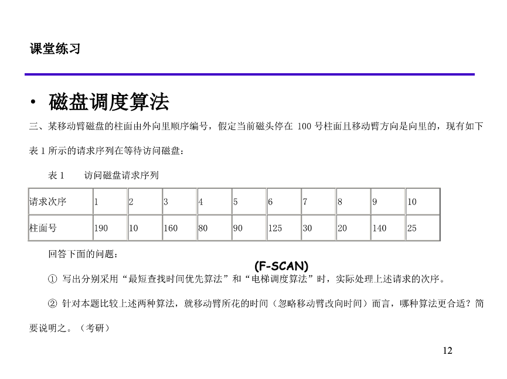

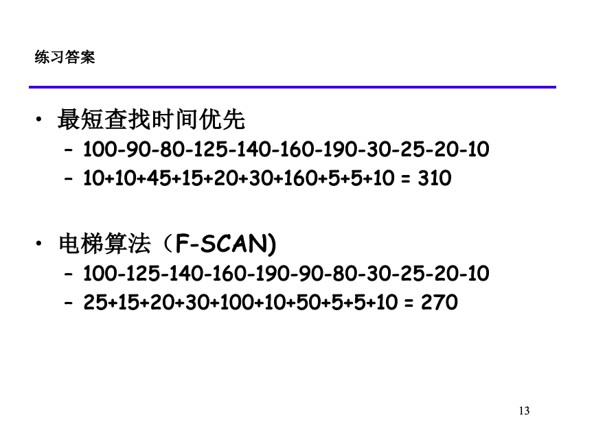

#### 固态硬盘

**混合映射 (Hybrid Mapping)**：

混合映射的核心思想之一是引入**日志块**。它将闪存空间分为两种类型的块：

* **数据块（Data Block）**：存储相对稳定、不经常更新的数据。这些块通常采用块级映射，以节省映射表空间。
* **日志块（Log Block）**：专门用于处理随机写入和更新操作。当主机写入或更新少量数据时，这些数据会被写入日志块中的新页面。日志块通常采用页面级映射，以便灵活地记录新的逻辑页面到物理页面的映射关系。

当一个日志块被填满，或者其中包含的有效数据（即没有被更新或删除的数据）数量较少时，SSD会触发一个“**合并（Merge）**”操作。这个操作会将日志块中的有效数据与它所对应的数据块中的有效数据合并到一个新的空闲数据块中，然后擦除旧的日志块和数据块。这个过程类似于日志结构文件系统（LFS）中的清理操作。

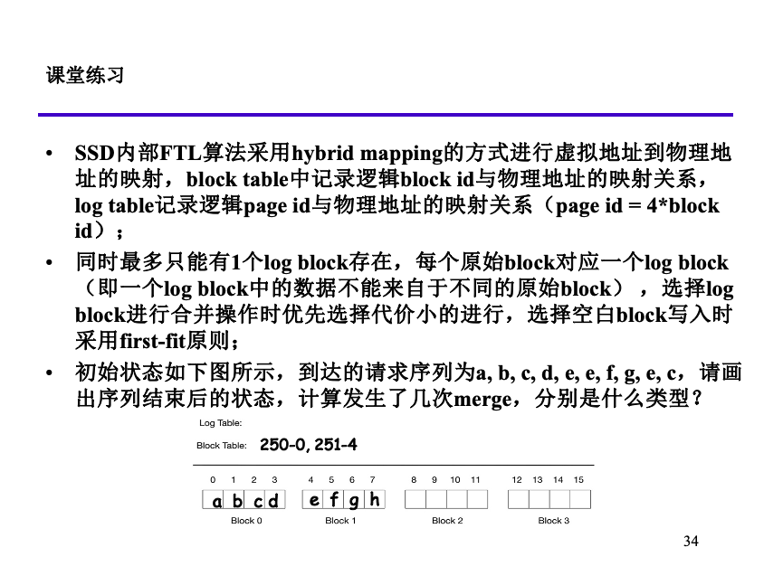

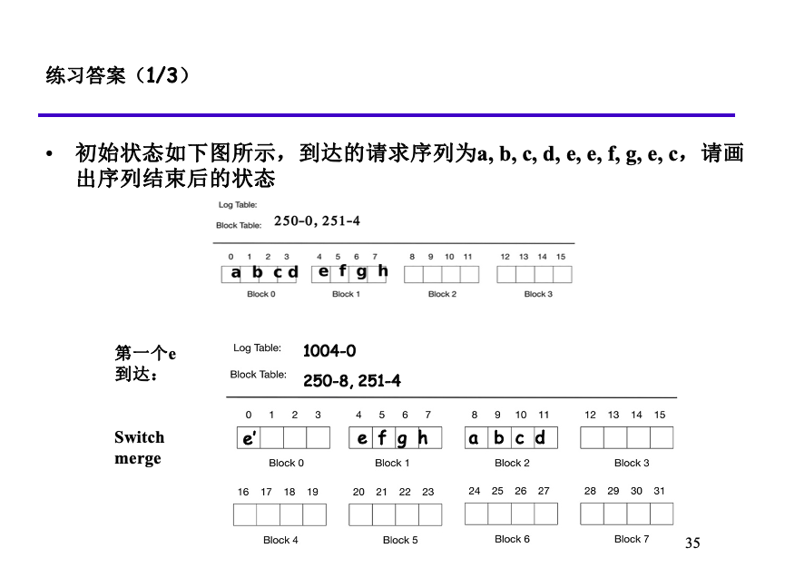

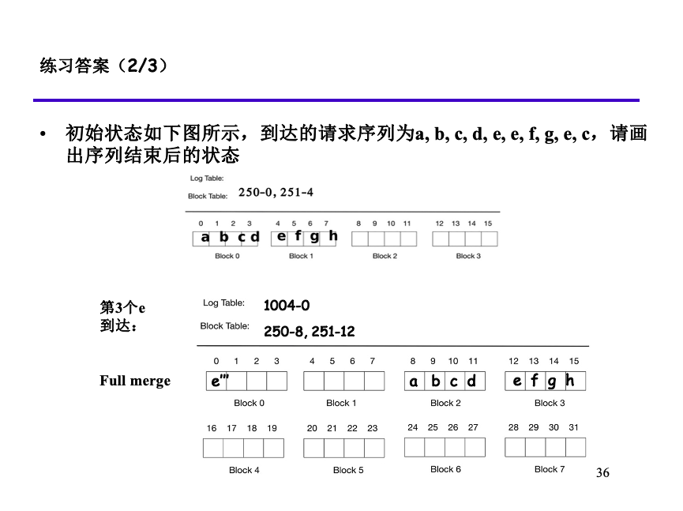

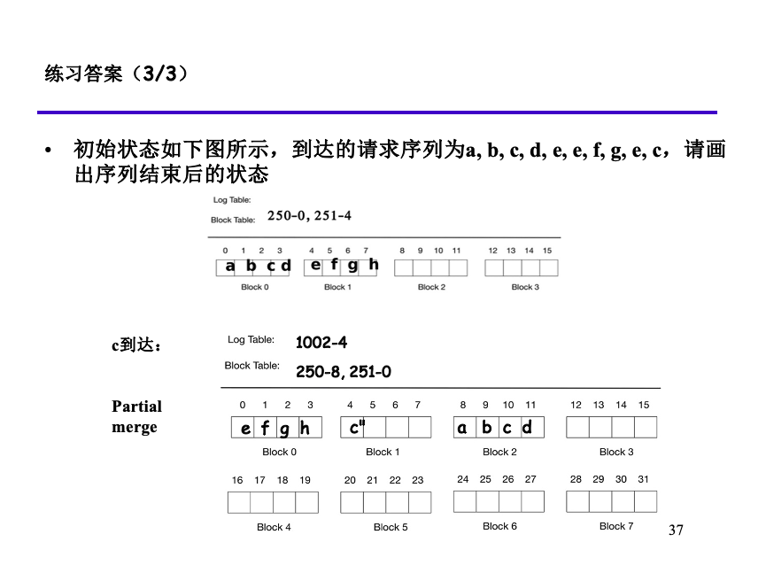

### Unix I/O

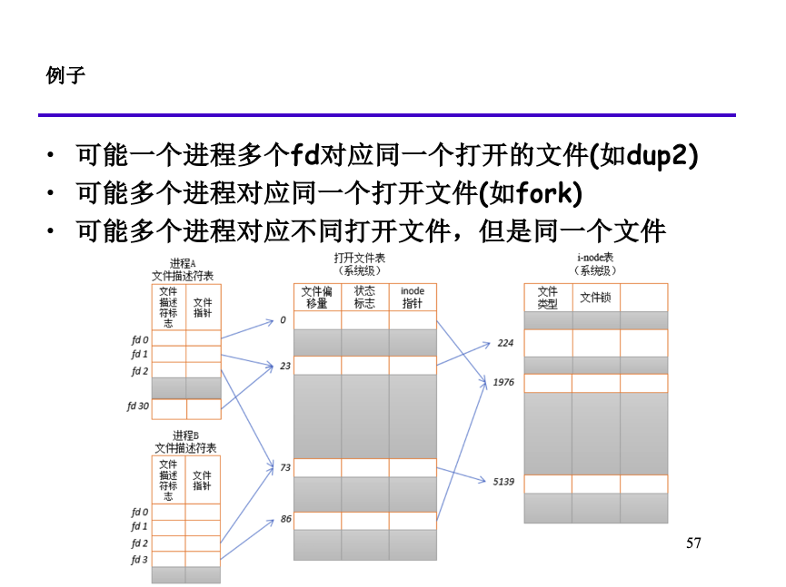

应用程序只需要维护文件描述符，其他信息都在kernel数据结构中。

一个应用程序可以通过seek操作，显式的设置文件的当前访问位置。

一个进程的文件描述符有上限。

The next file that is opened is guaranteed to receive the smallest available descriptor in the pool.

| FD | File |
| - | - |
| 0 | stdin |
| 1 | stdout |
| 2 | stderr |

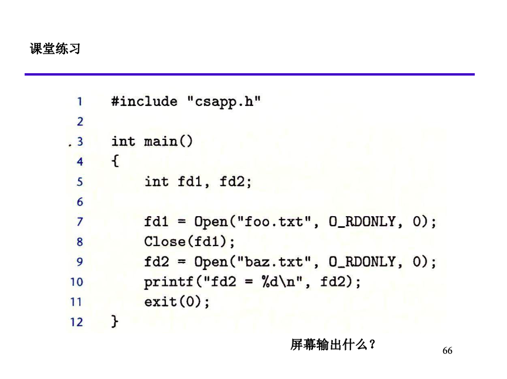

答案：3

### Reading File Metadata

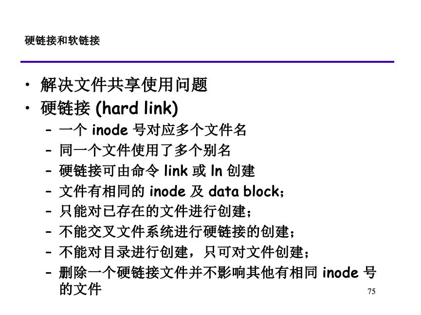

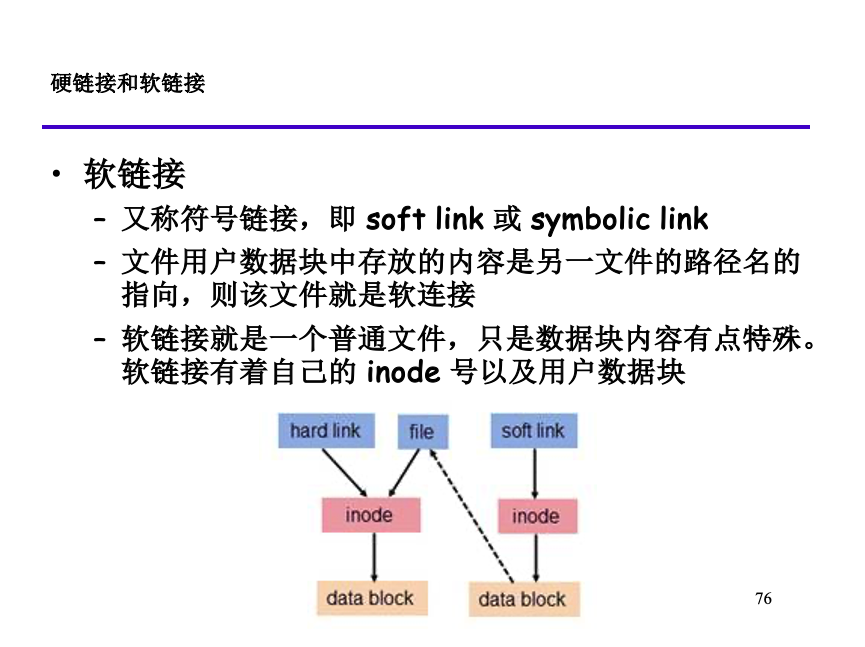

### Sharing Files & I/O redirection

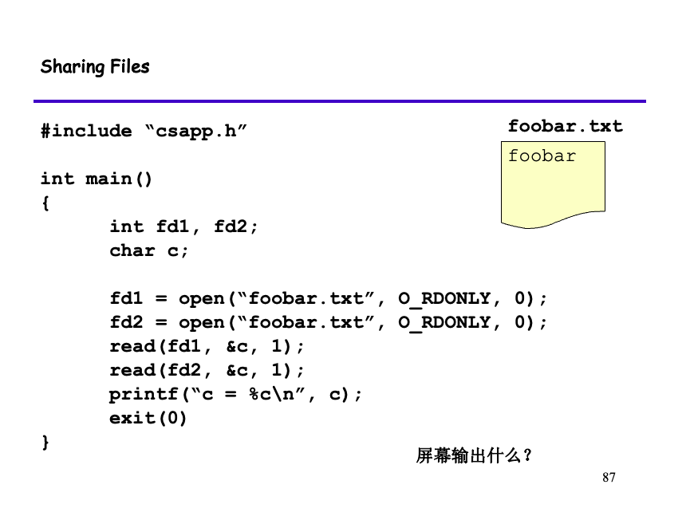

答案：f

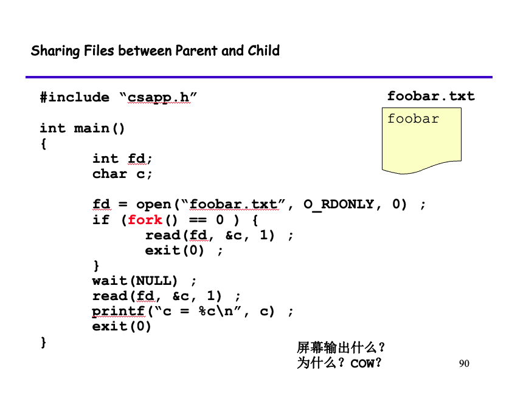

答案：o

dup2() 函数会修改fd表，但是不会修改open file table。

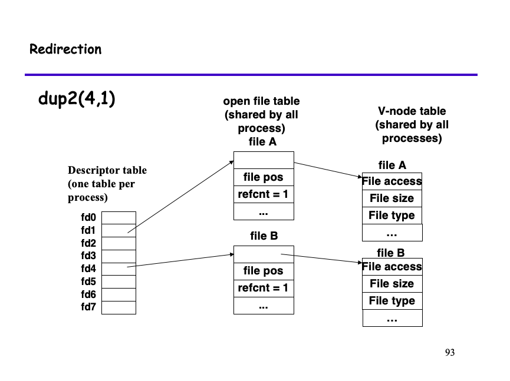

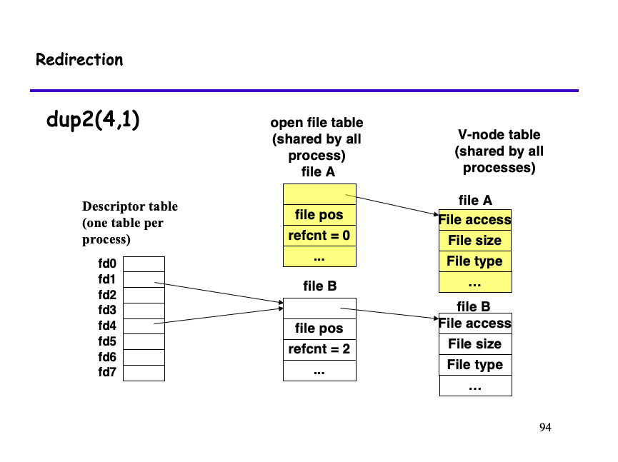

### Linux I/O Stack

### File System

### File System Implementation

### Fast File System

### FSCK and Journaling

## Parallelism: Threads and Locks

### Posix threads (Pthreads) interface

### Measuring Speedup

### Semaphores

### Mutex

### RwLock

### Spinlock

### Two-phase Locking

### CAS
